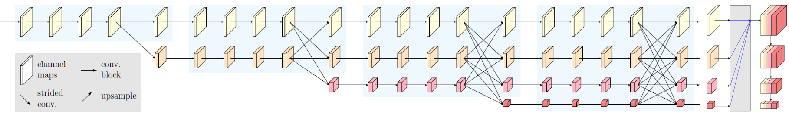

# HRNet for Object Detection


## Introduction
This is the official code of [High-Resolution Representations for Object Detection](https://arxiv.org/pdf/1904.04514.pdf). We extend the high-resolution representation (HRNet) [1] by augmenting the high-resolution representation by aggregating the (upsampled) representations from all the parallel convolutions, leading to stronger representations. We build a multi-level representation from the high resolution and apply it to the Faster R-CNN, Mask R-CNN and Cascade R-CNN framework. This proposed approach achieves superior results to existing single-model networks on COCO object detection. The code is based on [maskrcnn-benchmark](https://github.com/facebookresearch/maskrcnn-benchmark)

<div align=center>



</div>


## Performance

### ImageNet Pretrained Models
HRNetV2 ImageNet pretrained models are now available! Codes and pretrained models are in [HRNets for Image Classification](https://github.com/HRNet/HRNet-Image-Classification)

All models are trained on COCO *train2017* set and evaluated on COCO *val2017* set. Detailed settings or configurations are in [`configs/hrnet`](configs/hrnet).

**Note:** Models are trained with the newly released code and the results have minor differences with that in the paper. 
Current results will be updated soon and more models and results are comming.
All models are trained on COCO *train2017* set and evaluated on COCO *val2017* set. Detailed settings or configurations are in [`configs/hrnet`](configs/hrnet).


### Faster R-CNN

|Backbone|lr sched|mAP|model|
|:--:|:--:|:--:|:--:|
| HRNetV2-W18 | 1x | 36.0 | [FasterR-CNN-HR18-1x.pth](https://1drv.ms/u/s!AjfnYvdHLH5Tb3LeGHSr0sODD1w)|
| HRNetV2-W18 | 2x | 38.4 | [FasterR-CNN-HR18-2x.pth](https://1drv.ms/u/s!AjfnYvdHLH5TcO7N8YfGvZ0Ml0Q)|
| HRNetV2-W32 | 1x | 39.6 | [FasterR-CNN-HR32-1x.pth](https://1drv.ms/u/s!AjfnYvdHLH5TchNk9JT8VlWkYcI)|
| HRNetV2-W32 | 2x | 40.9 | [FasterR-CNN-HR32-2x.pth](https://1drv.ms/u/s!AjfnYvdHLH5TbBZscXZo3DKSU74)|
| HRNetV2-W40 | 1x | 40.4 | [FasterR-CNN-HR40-1x.pth](https://1drv.ms/u/s!AjfnYvdHLH5Tcfwfqrg_9Y8dbPM)|
| HRNetV2-W40 | 2x | 41.4 | [FasterR-CNN-HR40-2x.pth](https://1drv.ms/u/s!AjfnYvdHLH5Tc4wM4S6SCZMbI8I)|
| HRNetV2-W48 | 1x | 41.3 | [FasterR-CNN-HR48-1x.pth](https://1drv.ms/u/s!AjfnYvdHLH5TbV9Wna7hJMI1Y8Q)|
| HRNetV2-W48 | 2x | 41.8 | [FasterR-CNN-HR48-2x.pth](https://1drv.ms/u/s!AjfnYvdHLH5TbpnJXuD_3jL-wsc)|


### Faster R-CNN with more training iterations

|Backbone|lr sched|mAP|model|
|:--:|:--:|:--:|:--:|
| HRNetV2-W32 | 1x | 39.6 | [FasterR-CNN-HR32-1x.pth](https://1drv.ms/u/s!AjfnYvdHLH5TchNk9JT8VlWkYcI)|
| HRNetV2-W32 | 2x | 40.9 | [FasterR-CNN-HR32-2x.pth](https://1drv.ms/u/s!AjfnYvdHLH5TbBZscXZo3DKSU74)|
| HRNetV2-W32 | 3x | 41.4 | [FasterR-CNN-HR32-3x.pth](https://1drv.ms/u/s!AjfnYvdHLH5TeLUahrIPnA60fr8)|
| HRNetV2-W32 | 4x | 41.6 | [FasterR-CNN-HR32-4x.pth](https://1drv.ms/u/s!AjfnYvdHLH5TeLUahrIPnA60fr8)|

Our HRNets will obtain larger gain when training with more iterations. 

## Quick start

#### Install

1. Install PyTorch 1.0 following the [official instructions](https://pytorch.org/)

2. Install `pycocotools`
````bash
git clone https://github.com/cocodataset/cocoapi.git \
 && cd cocoapi/PythonAPI \
 && python setup.py build_ext install \
 && cd ../../
````
3. Install `HRNet-MaskRCNN-Benchmark`

````bash

git clone https://github.com/HRNet/HRNet-MaskRCNN-Benchmark.git
cd HRNet-MaskRCNN-Benchmark
python setup.py build develop
pip install -r requirements.txt
````

for more details, see [INSTALL.md](INSTALL.md)


#### HRNetV2 Pretrained models

```bash
cd HRNet-MaskRCNN-Benchmark
# Download pretrained models into this folder
mkdir hrnetv2_pretrained
```

#### Train (multi-gpu training)
Please specify the configuration file in `configs` (learning rate should be adjusted when the number of GPUs is changed).
````bash
python -m torch.distributed.launch --nproc_per_node <GPU NUMS> tools/train_net.py --config-file <CONFIG FILE>

# example (4 gpus)
python -m torch.distributed.launch --nproc_per_node 4 tools/train_net.py --config-file configs/hrnet/e2e_faster_rcnn_hrnet_w18_1x.yaml

````

#### Test

````bash
python -m torch.distributed.launch --nproc_per_node <GPU NUMS> tools/test_net.py --config-file <CONFIG-FILE> MODEL.WEIGHT <WEIGHT>

#example (4gpus)
python -m torch.distributed.launch --nproc_per_node 4 tools/test_net.py --config-file configs/hrnet/e2e_faster_rcnn_hrnet_w18_1x.yaml MODEL.WEIGHT FasterR-CNN-HR18-1x.pth

````

**NOTE:** If you meet some problems, you may find a solution in [issues of official maskrcnn-benchmark](https://github.com/facebookresearch/maskrcnn-benchmark/issues) 
 or submit a new issue in our repo.

## Other applications of HRNets (codes and models):
* [Human pose estimation](https://github.com/leoxiaobin/deep-high-resolution-net.pytorch)
* [Semantic segmentation](https://github.com/HRNet/HRNet-Semantic-Segmentation)
* [Facial landmark detection](https://github.com/HRNet/HRNet-Facial-Landmark-Detection)
* [Image classification](https://github.com/HRNet/HRNet-Image-Classification)
* [Object detection](https://github.com/HRNet/HRNet-Object-Detection)(based on mmdetection)

## Citation
If you find this work or code is helpful in your research, please cite:
````
@inproceedings{SunXLW19,
  title={Deep High-Resolution Representation Learning for Human Pose Estimation},
  author={Ke Sun and Bin Xiao and Dong Liu and Jingdong Wang},
  booktitle={CVPR},
  year={2019}
}

@article{WangSCJDZLMTWLX19,
  title={Deep High-Resolution Representation Learning for Visual Recognition},
  author={Jingdong Wang and Ke Sun and Tianheng Cheng and 
          Borui Jiang and Chaorui Deng and Yang Zhao and Dong Liu and Yadong Mu and 
          Mingkui Tan and Xinggang Wang and Wenyu Liu and Bin Xiao},
  journal   = {TPAMI}
  year={2019}
}
````

## Reference

[1] Deep High-Resolution Representation Learning for Visual Recognition. Jingdong Wang, Ke Sun, Tianheng Cheng, 
    Borui Jiang, Chaorui Deng, Yang Zhao, Dong Liu, Yadong Mu, Mingkui Tan, Xinggang Wang, Wenyu Liu, Bin Xiao. Accepted by TPAMI.  [download](https://arxiv.org/pdf/1908.07919.pdf)

[2] Cascade R-CNN: Delving into High Quality Object Detection. Zhaowei Cai, and Nuno Vasconcetos. CVPR 2018.
